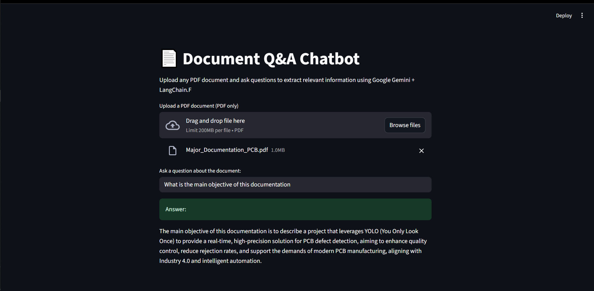

# 📄 Document Q&A Chatbot with LangChain + Google Gemini

A powerful Streamlit-based chatbot that lets you **upload any PDF document** and **ask natural language questions**, returning answers sourced directly from the document using **Retrieval-Augmented Generation (RAG)**.

Built using:
- [LangChain](https://www.langchain.com/)
- [Google Gemini AI](https://deepmind.google/technologies/gemini/)
- [FAISS](https://github.com/facebookresearch/faiss) vector store
- [Streamlit](https://streamlit.io/)

---

## ✨ Demo

 <!-- Replace with your own screenshot path or hosted image -->

---

## 🔍 Features

- 📂 Upload any PDF document (research papers, reports, resumes, etc.)
- 💬 Ask any question and get context-aware answers
- 🧠 Uses Retrieval-Augmented Generation (RAG) for accurate results
- 🔎 Embeds your document and performs semantic search with FAISS
- ⚡️ Uses Google Gemini (via LangChain) as the LLM backend
- 🚀 Fast, interactive UI using Streamlit

---

## 📁 Use Cases

- Extracting key information from technical PDFs
- Understanding research papers or documentation
- Querying project reports or manuals
- Portfolio chatbot project (showcase LLM + RAG skills!)

---

## 💼 Tech Stack

| Component       | Tech                                                  |
|----------------|--------------------------------------------------------|
| Frontend UI     | [Streamlit](https://streamlit.io/)                    |
| LLM Backend     | [Google Gemini 2.5 Flash](https://deepmind.google/)   |
| Embeddings      | Gemini Embedding 001                                  |
| Vector DB       | [FAISS](https://github.com/facebookresearch/faiss)    |
| Framework       | [LangChain](https://www.langchain.com/)               |
| PDF Loader      | LangChain Community PyPDFLoader                       |
| Deployment      | Local or Streamlit Cloud                              |

---

## 🚀 Getting Started

### 🔧 Prerequisites

- Python 3.10+
- Google Generative AI API key (set in `.env`)
